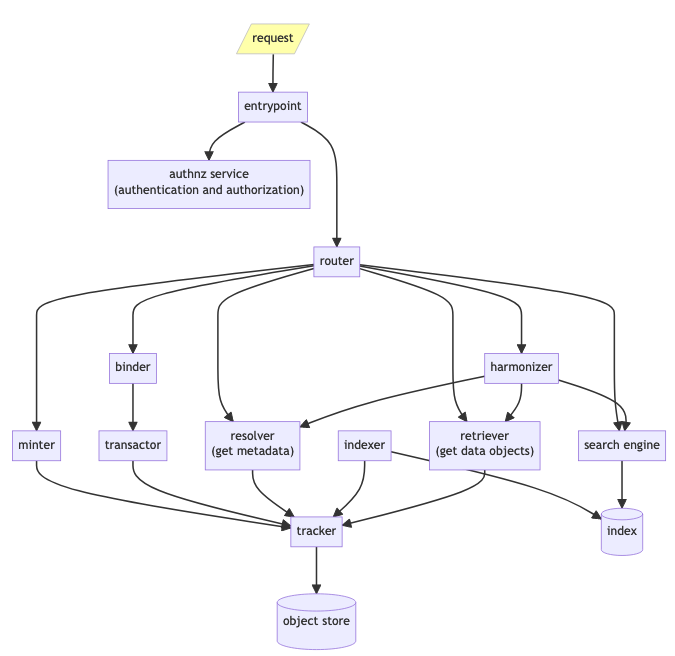

An attempt to design and deploy prototypical [FAIR-Enabling Services](https://donnywinston.com/posts/implementing-the-fair-principles-through-fair-enabling-artifacts-and-services/).

## Intro

Related to [FAIR-Enabling Resource](https://w3id.org/fair/fip/terms/FAIR-Enabling-Resource) ***artifacts***, from the [FAIR Implementation Profile (FIP) ontology](https://w3id.org/fair/fip/terms/FIP-Ontology), are ***services***. These services are what you deploy to implement each of the 15 [FAIR Principles](https://w3id.org/fair/principles/terms/FAIR) (from Box 2 of the [seminal publication](https://doi.org/10.1038/sdata.2016.18)) for any actual given digital research object. 

## Design

### Service architecture flow diagram

(click on diagram to go to the [Mermaid](https://mermaid.js.org/) Markdown source file in this repo)

### Code architecture

Attempting a domain-driven design and event-driven microservices approach, with corresponding code organization, as detailed by Percival and Gregory in [^patterns].

## Further Reading

Ideas evolved from:
* [2022-10-03] https://donnywinston.com/posts/fair-enabling-services-redux/
* [2022-10-17] https://donnywinston.com/posts/architecture-patterns-for-fair-enabling-services/
* [2022-10-21] https://donnywinston.com/posts/implementing-the-fair-principles-through-fair-enabling-artifacts-and-services/

[2022-12-21] [https://doc.traefik.io/traefik/routing/overview/](https://web.archive.org/web/20221221152411/https://doc.traefik.io/traefik/routing/overview/)

[^patterns]: H. J. W. Percival and R. G. Gregory, _Architecture patterns with Python: enabling test-driven
development, domain-driven design, and event-driven microservices_, First edition. O’Reilly, 2020.
([available online](https://www.cosmicpython.com/book/preface.html)).
