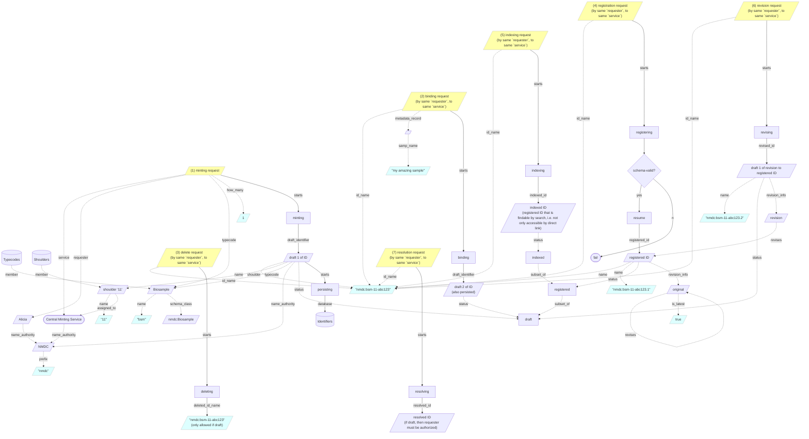

```mermaid
flowchart TD
    %% t1(["terminator (process start/end)"])
    %% s1["(process) step"]
    %% d1{decision}
    %% b1[("(data)base")]
    %% m1[\manual step/]
    %% o1[/"(input/output) object"/]
    %% p1[[predefined step]]
    classDef literal fill:#dff;,stroke:#bbb
    classDef user fill:#ffa;,stroke:#bbb

    b_typecodes[(Typecodes)]-. member .->o_biosample[/Biosample/]
    o_biosample-. name .->o_tcbiosample[/"#quot;bsm#quot;"/]:::literal
    o_biosample-. schema_class .->o_nmdc_schema_biosample[/"nmdc:Biosample"/]
    b_shoulders[(Shoulders)]-. member .->o_s11[/shoulder '11'/]
    o_s11-. name .->o_11[/"#quot;11#quot;"/]:::literal

    click o_nmdc_schema_biosample href "https://microbiomedata.github.io/nmdc-schema/Biosample"

    o_request[/"(1) minting request"/]:::user-. service .->t_service(["Central Minting Service"])
    o_request-. requester .->o_requester[/Alicia/]
    o_request-. typecode .->o_biosample
    o_request-. how_many .->o_howmany[/"1"/]:::literal
    o_requester-. name_authority .->o_naa[/NMDC/]
    o_naa-. prefix .->o_pfx[/"#quot;nmdc#quot;"/]:::literal
    
    t_service-. name_authority .->o_naa
    o_request-- starts -->s_minting[minting]
    o_s11-. assigned_to .-> t_service

    s_minting-- draft_identifier -->o_id_draft1[/draft 1 of ID/]
    o_id_draft1-. name .->o_idname[/"#quot;nmdc:bsm-11-abc123#quot;"/]:::literal
    o_id_draft1-. shoulder .->o_s11
    o_id_draft1-. typecode .-> o_biosample
    o_id_draft1-. name_authority .->o_naa
    o_id_draft1-. status .-> draft

    o_id_draft1-- starts -->s_persisting[persisting]
    s_persisting-- database -->b_identifiers[(Identifiers)]

    o_bindreq[/"(2) binding request\n(by same `requester`, to same `service`)"/]:::user
    o_bindreq-. id_name .-> o_idname
    o_bindreq-. metadata_record .->o_mybiosample[/ /]
    o_mybiosample-. samp_name .->o_samp_name[/"#quot;my amazing sample#quot;"/]:::literal
    %% o_bindreq-. requester .->o_requester
    %% o_bindreq-. service .->t_service
    o_bindreq-- starts ----->s_binding[binding]
    s_binding-- draft_identifier -->o_id_draft2[/"draft 2 of ID\n(also persisted)"/]
    o_id_draft2-. status .-> draft

    o_delreq[/"(3) delete request\n(by same `requester`, to same `service`)"/]:::user
    o_delreq-. id_name .-> o_idname
    o_delreq-- starts ------>s_del[deleting]
    s_del-- deleted_id_name --> o_deleted_id_name[/"#quot;nmdc:bsm-11-abc123#quot;\n(only allowed if draft)"/]:::literal

    o_regreq[/"(4) registration request\n(by same `requester`, to same `service`)"/]:::user
    o_regreq-. id_name .-> o_idname
    o_regreq-- starts ------>s_reg[registering]
    s_reg-->d_schema_valid{schema-valid?}
    d_schema_valid--yes-->s_resume_registering[resume]
    d_schema_valid--no-->t_fail([fail])
    s_resume_registering-- registered_id --> o_registered_id[/"registered ID"/]
    o_registered_id-. name .->o_idname
    o_registered_id-. name .->o_registeredidname[/"#quot;nmdc:bsm-11-abc123.1#quot;"/]:::literal
    o_registered_id-. status .-> registered
    o_registered_id-. revision_info .-> o_registered_id_1[/original/]
    o_registered_id_1-. revises .->o_registered_id_1
    o_registered_id_1-. is_latest .-> true[/true/]:::literal
    registered-. subset_of .-> draft

    o_idxreq[/"(5) indexing request\n(by same `requester`, to same `service`)"/]:::user
    o_idxreq-. id_name .-> o_idname
    o_idxreq-- starts ------>s_idx[indexing]
    s_idx-- indexed_id --> o_indexed_id[/"indexed ID\n(registered ID that is findable by search, i.e. not only accessible by direct link)"/]
    o_indexed_id-. status .-> indexed
    indexed-. subset_of .-> registered
    
    o_revreq[/"(6) revision request\n(by same `requester`, to same `service`)"/]:::user
    o_revreq-. id_name .-> o_idname
    o_revreq-- starts ------>s_rev[revising]
    s_rev-- revised_id --> o_revised_id[/"draft 1 of revision to registered ID"/]
    o_revised_id-. name .->o_revisedidname[/"#quot;nmdc:bsm-11-abc123.2#quot;"/]:::literal
    o_revised_id-. status .-> draft
    o_revised_id-. revision_info .-> o_revision[/revision/]
    o_revision[/revision/]-. revises .->o_registered_id

    o_resreq[/"(7) resolution request\n(by same `requester`, to same `service`)"/]:::user
    o_resreq-. id_name .-> o_idname
    o_resreq-- starts ------> s_res[resolving]
    s_res-- resolved_id --> o_resolved_id[/"resolved ID\n(if draft, then requester must be authorized)"/]
```