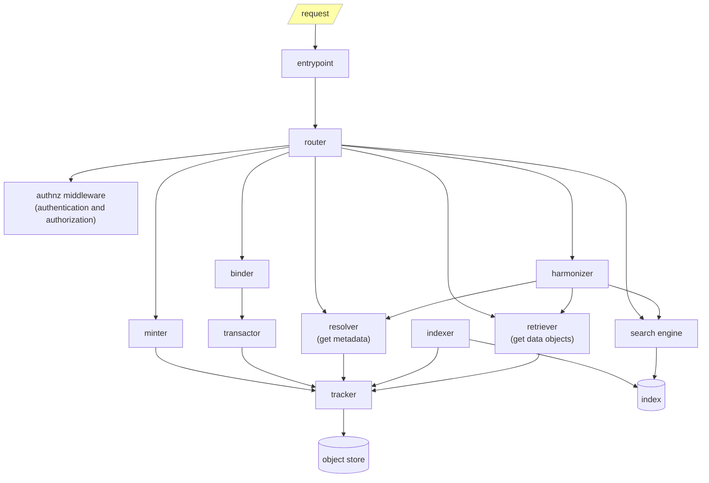

```mermaid
flowchart TD
    %% b1[("(data)base")]
    %% d1{decision}    
    %% m1[\manual step/]
    %% o1[/"(input/output) object"/]
    %% p1[[predefined step]]
    %% s1["(process) step"]
    %% t1(["terminator (process start/end)"])       
    classDef literal fill:#dff;,stroke:#bbb
    classDef user fill:#ffa;,stroke:#bbb

    s_minter[minter]
    s_tracker[tracker]
    s_transact[transactor]
    s_indexer[indexer]
    s_resolver["resolver\n(get metadata)"]
    s_retriever["retriever\n(get data objects)"]
    s_harmonizer[harmonizer]
    s_binder[binder]
    b_index[(index)]
    b_object_store[("object store")]
    s_seng["search engine"]
    s_authnz["authnz middleware\n(authentication and authorization)"]
    o_request[/request/]:::user
    s_entrypoint[entrypoint]
    s_router[router]

    %%  edge authnz + routing
    o_request-->s_entrypoint
    s_entrypoint--->s_router
    s_router-->s_authnz
    
    %% minting
    s_router--->s_minter  
    s_minter-->s_tracker
    s_tracker-->b_object_store

    %% binding
    s_router--->s_binder
    s_binder-->s_transact
    s_transact-->s_tracker

    %% resolving
    s_router--->s_resolver
    s_resolver-->s_tracker

    %% indexing
    s_indexer-->s_tracker
    s_indexer-->b_index      

    %% search
    s_router--->s_seng
    s_seng-->b_index

    %% retrieving
    s_router--->s_retriever
    s_retriever-->s_tracker

    %% harmonizing
    s_router--->s_harmonizer
    s_harmonizer-->s_seng
    s_harmonizer-->s_resolver
    s_harmonizer-->s_retriever
```  
